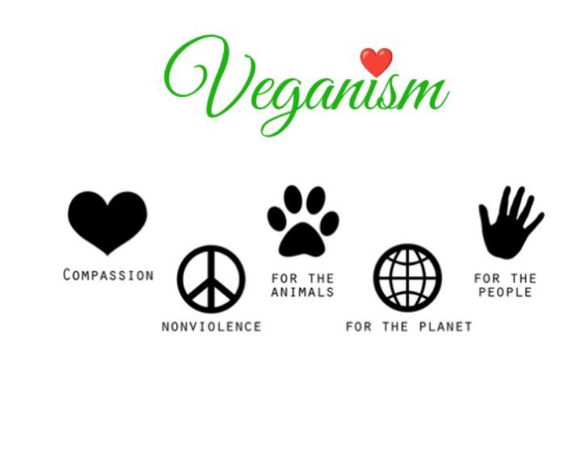

# One look over the definition of veganism

Welcome to our page all about the definition of veganism! Here, we'll be diving deep into what veganism is, the reasoning behind it, and how it can positively impact your life, the environment, and the lives of animals.

At its core, veganism is a lifestyle and ethical choice that seeks to exclude, as far as is possible and practical, all forms of exploitation and cruelty to animals for food, clothing, or any other purpose. This means avoiding meat, dairy, eggs, and any other animal-derived products. Veganism also extends to avoiding products that are tested on animals or contain animal-derived ingredients, such as certain cosmetics and clothing.

People choose to be vegan for a variety of reasons, including health, environmental concerns, and ethical considerations. Some people may be drawn to the health benefits of a plant-based diet, such as a lower risk of chronic diseases. Others may be motivated by the environmental impact of animal agriculture, which is a leading cause of deforestation, water pollution, and greenhouse gas emissions. Still others may be driven by the ethical considerations of the treatment of animals in factory farming.

One of the most powerful aspects of veganism is its ability to make a positive impact on multiple issues at once. By choosing a vegan lifestyle, you're not only improving your own health and reducing your environmental impact, but you're also making a stand for the rights of animals. It's a simple yet impactful choice that can bring about a significant change in the world.

However, it's also worth noting that veganism can look different for everyone and there's no such thing as being **"perfectly vegan"**. It's about making choices that align with your values, and doing your best to reduce harm and exploitation as much as you can. It is also possible to find different types of veganism, like dietary veganism, that focuses on avoiding animal products in food and ethical veganism that goes further and avoids products that are tested on animals or contain animal-derived ingredients.

At the end of the day, veganism is a personal choice, and one that can bring about significant positive change in the world. Whether you're motivated by health, environmental concerns, or ethical considerations, there are many compelling reasons to give veganism a try. We hope you found this information informative and interesting, and we invite you to explore our other pages to learn more about the various aspects of veganism, its history, nutritional aspect, environmental impact, ethical considerations, and also check out our recipe section to try out delicious plant-based meals.
