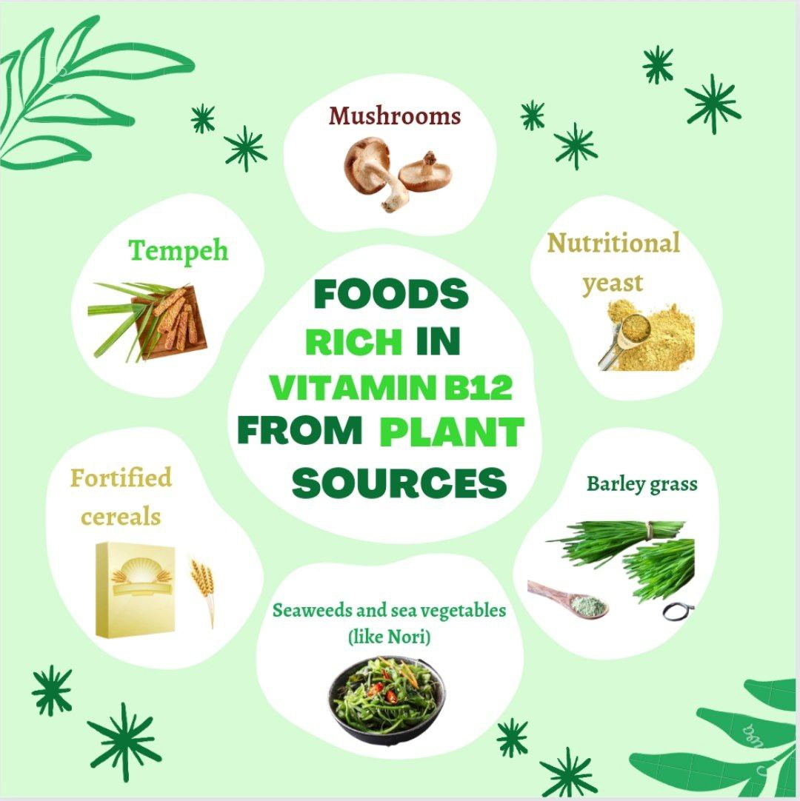

# Are Plant Based Sources Of Vitamin B12 Aren't Sufficient to satisfy the need of Human body ?

one of the most important nutrients for the human body, and the common myth that vegans don't get enough of it.

Vitamin B12 is a vital nutrient that plays a key role in the proper functioning of the brain and nervous system, as well as the formation of red blood cells. It is not produced by plants or animals, but rather by microorganisms, and it is found in small amounts in soil and water. Historically, humans would consume B12 from these sources when consuming unwashed fruits and vegetables, but due to modern agricultural practices and food preparation methods, it is not as common to find B12 in these ways.

One of the most persistent myths about a vegan diet is that vegans don't get enough Vitamin B12. However, this is simply not true. While it is true that animal products are the most common dietary source of Vitamin B12, it is also true that it is possible for vegans to get enough Vitamin B12 from plant-based sources and supplements.

Plant-based sources of Vitamin B12 include fortified foods such as plant-based milk, breakfast cereals, and nutritional yeast. Additionally, many vegans choose to take a Vitamin B12 supplement, either as a pill or a sublingual (under the tongue) tablet. It's important to consult with a healthcare provider or registered dietitian to determine the appropriate dosage and frequency of supplementation.

It's also worth noting that Vitamin B12 deficiency can occur in non-vegans as well, as it is not only a vegan issue, it can happen to anyone who has a diet lacking in this vitamin, or with certain health conditions that affect the absorption of nutrients like B12. However, studies have shown that vegans are at a higher risk of deficiency because of the lack of B12 in plant-based sources.

A 2020 systematic review and meta-analysis of studies, published in the Journal of Nutritional Science, found that vitamin B12 deficiency is prevalent in both vegetarians and vegans, and that a daily vitamin B12 supplement is important to ensure adequate intake, as well as regular monitoring of vitamin B12 status in vegetarians and vegans.

It's important to note that the lack of Vitamin B12 can lead to serious health issues such as anemia, nerve damage, and cognitive decline if not addressed, thus it is a crucial nutrient for overall health.

In conclusion, it is a myth that vegans don't get enough Vitamin B12, but it's true that it can be more difficult to obtain from plant-based sources. By including fortified foods and taking a supplement, vegans can easily meet their Vitamin B12 needs and maintain optimal health. It's also important to note that this is not just a concern for vegans, but for everyone to make sure they are getting enough Vitamin B12 in their diet and to consult with a healthcare provider or registered dietitian if they have any concerns. To help you with it here are some of the plant based alternatirea for vit.B12 . 

`Keep doing more & more research about it and keep experimenting `.

It is also worth noting that, a vegan diet can provide many health benefits such as reducing the risk of chronic diseases, promoting weight loss, and improving heart health. It is also a more sustainable and ethical way of eating as it reduces the environmental impact of animal agriculture, and the exploitation of animals.

In addition, the food choices we make have a direct impact on the planet and the animals we share it with. By choosing a vegan diet, we reduce the demand for animal products and support more sustainable and ethical ways of farming. Therefore, by choosing a vegan diet, not only we can meet our nutritional needs, but also support a more environmentally and ethically conscious way of living.

In summary, this page has provided extensive and advanced information on the importance of Vitamin B12 and the myth that vegans don't get enough of it. By including fortified foods and taking a supplement, vegans can easily meet their Vitamin B12 needs and maintain optimal health, all while supporting an environmentally and ethically conscious way of living.
