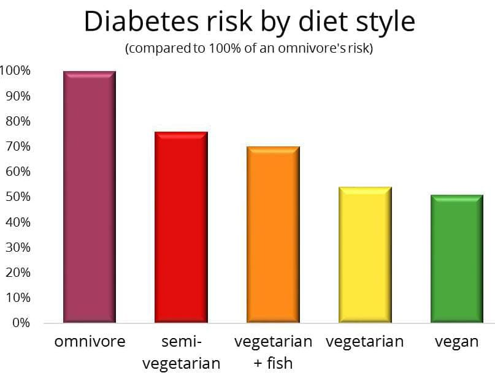

# Non-Vegan Diets Can Increase the Risk Of Diabetes 

We know that diabetes is a serious health concern that affects millions of people around the world, and we're here to show you how going vegan can make a real difference.

Type 2 diabetes is a chronic condition that occurs when the body becomes resistant to insulin, a hormone that regulates blood sugar levels. It is often caused by a combination of genetic and lifestyle factors, and is strongly linked to **diet** and **weight**. Studies have shown that a plant-based diet can be an effective way to lower the risk of type 2 diabetes.

One of the main reasons why a vegan diet can lower the risk of type 2 diabetes is because it is typically lower in saturated fat and cholesterol. Saturated fat and cholesterol can increase the risk of heart disease and other health problems, and they are found in large amounts in animal products such as meat, dairy, and eggs. In contrast, plant-based foods are naturally low in saturated fat and cholesterol, making them a healthier choice.

A vegan diet is also typically higher in fiber, which can help to regulate blood sugar levels. Fiber can slow the absorption of sugar in the bloodstream, and it can help to keep you feeling full and satisfied for longer, which can help to prevent overeating. Fiber is found in many plant-based foods, such as fruits, vegetables, whole grains, and legumes.

Additionally, a vegan diet can also promote weight loss and help with weight management, which is a risk factor for type 2 diabetes. Plant-based diets are often lower in calories than diets that include animal products, and they can help to promote weight loss, reduce obesity, and improve overall health.

Several studies have provided evidence that vegan diet can lower the risk of type 2 diabetes, one of them published in the *American Journal of Clinical Nutrition in 2019*, showed that vegan diets are associated with lower levels of HbA1c (a marker of blood sugar control) and lower risk of type 2 diabetes than non-vegetarian diets. Another study published in the Journal of Geriatric Cardiology in 2018, found that a vegan diet was associated with a lower risk of type 2 diabetes in older adults.

It's important to note that a vegan diet alone is not a "silver bullet" solution to prevent type 2 diabetes, it's also important to maintain a healthy weight and regular physical activity, have enough sleep, and manage stress levels. However, it is one of the most effective ways for individuals to reduce their risk of type 2 diabetes and improve overall health.

We hope you found this information on how a vegan diet can lower the risk of type 2 diabetes informative and interesting. Remember that every little bit helps, and by making small changes in your diet, you can make a big difference in your health. As always, it's important to consult with a healthcare  provider or registered dietitian if you have any questions 

