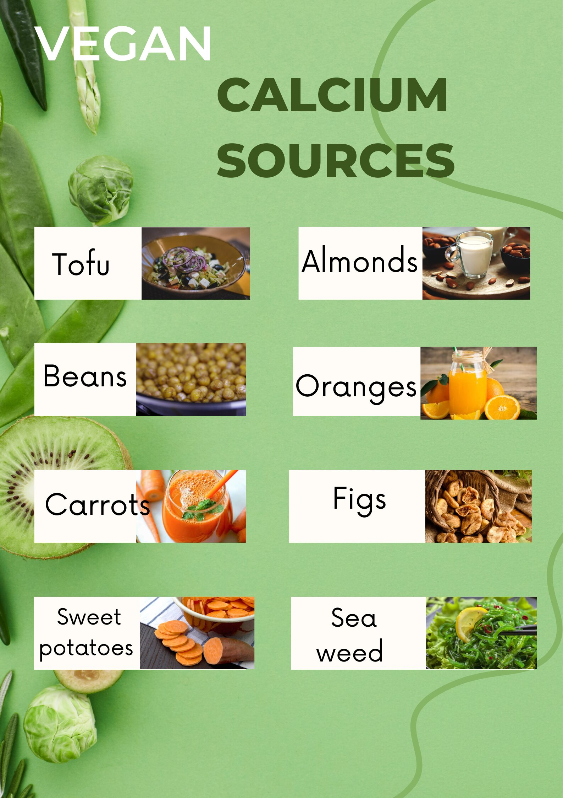

# Are Vegans Calcium Deficient (If Not Consuming Calcium Suppliments)?

Calcium is an essential nutrient that is needed for strong bones, teeth, and proper muscle and nerve function. Many people believe that the only way to get enough calcium is by consuming dairy products, but this is not the case. There are plenty of plant-based sources of calcium that can be easily incorporated into a vegan diet.

Plant-based sources of calcium include:

### Leafy & Green :
Such as kale, broccoli, and bok choy

### Nuts & Seeds : 
Such as almonds and sesame seeds

### Tofu and soy products : 
such as tempeh and edamame

### Legumes : 
such as black-eyed peas and navy beans

### Fortified plant milks :
Such as soy milk and almond milk

### Grains :
Such as quinoa and amaranth

### Fruits and vegetables : 
such as oranges and figs

It's important to note that the bioavailability of calcium from plant-based sources may not be as high as from dairy products. However, research has shown that vegans can meet their calcium needs from plant-based sources with proper planning and a balanced diet that includes a variety of calcium-rich foods.

One way to ensure you're getting enough calcium on a vegan diet is to make sure you're consuming adequate amounts of vitamin D, which helps the body absorb calcium. Good sources of vitamin D include fortified foods such as plant milks and breakfast cereals, as well as sunlight exposure.

It's also important to keep in mind that a healthy diet is not just about getting enough calcium, but also includes consuming a variety of nutrient-dense foods, getting enough physical activity, and maintaining a healthy weight. Additionally, having enough of other minerals and vitamins that aid in the absorption and metabolism of calcium, like Vitamin K, magnesium, and phosphorus are also crucial for bone health.

It's worth mentioning that a balanced vegan diet that includes a variety of nutrient-dense foods and fortified foods can provide enough calcium to meet the needs of individuals of all ages.

In conclusion, a vegan diet can provide all the necessary nutrients for a healthy lifestyle, and calcium is no exception. With a variety of plant-based sources and fortified foods, it's easy to meet your calcium needs on a vegan diet. Remember to consult with a healthcare provider or registered dietitian if you have any questions or concerns about your calcium intake.
