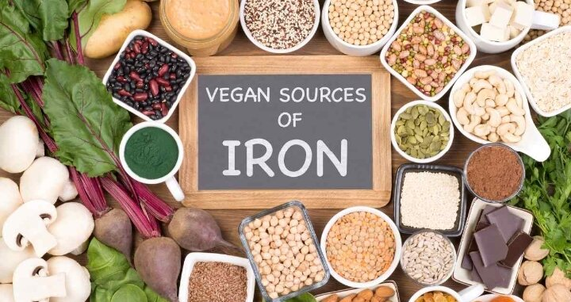

# Do Vegan Get Enough Amount Of Iron From Their Food ?

Welcome to our page all about plant-based sources of iron and how to absorb iron on a vegan diet! As vegans, it's important to make sure that we're getting enough iron in our diets, as iron is an essential mineral that plays a vital role in many bodily functions.

First, let's talk about some of the best plant-based sources of iron:

## Legumes:
Beans, lentils, and chickpeas are all great sources of iron.

## Whole grains: 
Whole wheat, quinoa, and oats are all good sources of iron.

## Tofu and tempeh:
Both tofu and tempeh are good sources of iron, especially when made with calcium sulfate.

## Dark leafy greens:
Spinach, kale, and collard greens are all excellent sources of iron.

## Dried fruits:
Prunes, raisins, and apricots are all high in iron.

## Nuts and seeds:
Pumpkin seeds, sunflower seeds, and cashews are all good sources of iron.

It's important to note that the iron found in plant-based foods is non-heme iron, which is not as well absorbed as the heme iron found in animal products. However, this doesn't mean that vegans have a harder time getting enough iron, as long as they have a varied and balanced diet.

There are some strategies that can help increase the absorption of non-heme iron:

Consuming vitamin C-rich foods at the same time as iron-rich foods can increase iron absorption. Vitamin C helps to convert non-heme iron into a form that is more easily absorbed by the body.
Avoiding tea, coffee, and calcium-rich foods with your iron-rich meals as they can inhibit iron absorption.
Eating fermented foods, like miso, tempeh, or natto, that are high in vitamin K2 may also help to increase iron absorption.
Additionally, it's important to remember that iron needs vary depending on factors such as age, sex, and pregnancy status. It's always a good idea to consult with a healthcare provider or a registered dietitian to determine your specific needs and ensure you're getting enough iron in your diet.

It's also worth noting that iron deficiency is not exclusive to vegans, and that people following any diet can develop deficiencies if they lack a varied and balanced diet.

We hope you found this information on plant-based sources of iron and how to absorb iron on a vegan diet informative and interesting. Remember that a varied and balanced plant-based diet can provide all the essential nutrients the body needs, including iron. You can also check our recipe section for delicious and nutritious iron-rich vegan meals ideas
