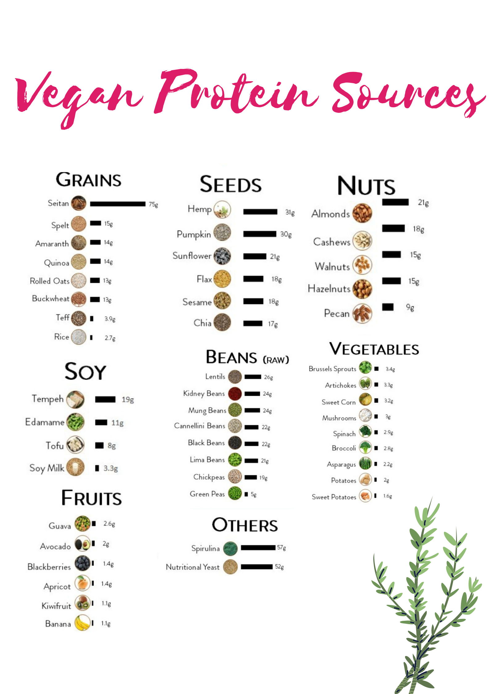

# "Vegan's Diet Is Protein Deficient." Let's Find Out the Truth 

A common misconception about a vegan diet is that it is lacking in protein, but this couldn't be further from the truth! There are plenty of plant-based sources of protein that are not only nutritious, but also delicious and versatile.

## Legumes: 
Legumes such as beans, lentils, and peas are an excellent source of plant-based protein. They are also a good source of fiber, iron, and other essential nutrients. Legumes can be used in a variety of dishes, from soups and stews to salads and veggie burgers.

## Nuts and seeds: 
Nuts and seeds, such as almonds, pumpkin seeds, and chia seeds, are also a good source of plant-based protein. They are also a good source of healthy fats and minerals, such as magnesium and zinc. Nuts and seeds can be used in a variety of dishes, from trail mix and granola, to nut butter and seed-based dressings.

## Whole grains:
Whole grains such as quinoa, bulgur, and amaranth are a great source of plant-based protein. They are also a good source of fiber, B vitamins, and other essential nutrients. Whole grains can be used in a variety of dishes, from pilafs and salads to soups and stews.

## Tofu and tempeh:
Tofu and tempeh are made from soybeans and are a good source of plant-based protein. They are also a good source of iron and other essential nutrients. Tofu and tempeh can be used in a variety of dishes, from stir-fries and soups to tofu scramble and tempeh bacon.

## Seitan: Seitan: 
also known as wheat gluten, is a good source of plant-based protein. It is made from wheat protein and has a chewy texture that makes it a popular meat alternative. Seitan can be used in a variety of dishes, such as seitan steaks, seitan burgers, and seitan sausages.

It's worth noting that it's easy to combine these different sources of plant-based proteins to create a balanced and nutritionally complete meal, and also to make sure to get a variety of amino acids, which are the building blocks of proteins.

It's also important to note that a vegan diet, when well-planned and balanced, can provide all the necessary nutrients, including proteins, for a healthy lifestyle. The Academy of Nutrition and Dietetics states that a vegan diet can be appropriate for all stages of life, including pregnancy, lactation, infancy, childhood, adolescence, older adulthood and for athletes.

We hope you found this information on plant-based sources of protein helpful and interesting, and that it dispels the myth that a vegan diet is lacking in protein. Remember that with a little bit of creativity and planning, it is easy to incorporate a variety of plant-based proteins into your diet and enjoy a well-balanced and nutritious meal. And even more, by choosing plant-based sources of protein, you are not only taking care of your own health, but also taking care of the planet, as producing plant-based protein requires less land, water and energy than animal-based protein.

Also, it's worth mentioning that plant-based sources of protein have other benefits such as being low in saturated fats and cholesterol and also rich in fiber and other essential nutrients. They also have been associated with lower risk of chronic diseases such as heart disease, type 2 diabetes and some types of cancer.

In conclusion, a vegan diet can provide all the necessary nutrients, including protein, for a healthy lifestyle. There are plenty of delicious and nutritious plant-based sources of protein, such as legumes, nuts, seeds, whole grains, tofu, tempeh and seitan, that can easily be incorporated into your meals. Not only is a vegan diet good for your own health, it's also good for the planet and the well-being of animals. With a little bit of creativity and planning, you can easily enjoy a well-balanced and nutritious vegan diet that includes plenty of protein.
